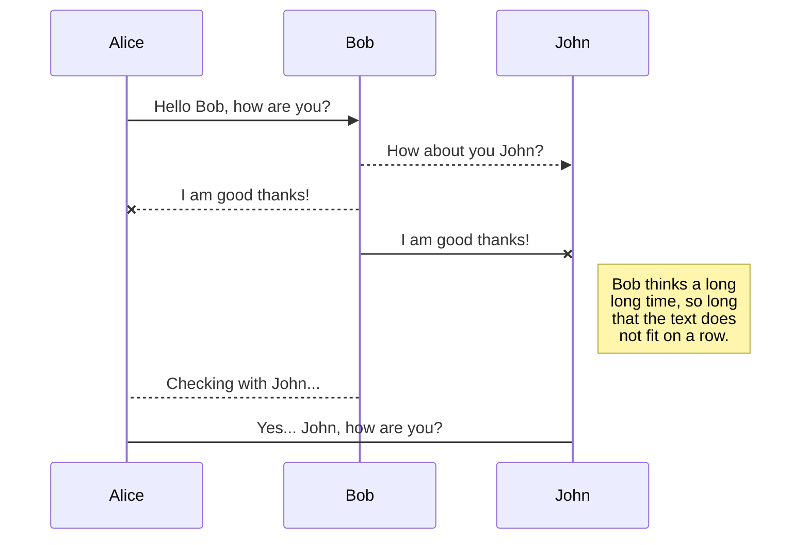

# LearnFlow LMS — Registration & Login

## 1. User Stories

**Registration**
- As a new user, I want to register with my email and password, so that I can create a LearnFlow account.
- As a new user, I want to receive validation errors for weak passwords or duplicate emails, so that I can correct my input before submitting.

**Login**
- As a registered user, I want to log in with my email and password, so that I can access my LearnFlow account.
- As a registered user, I want to receive a clear error when my credentials are invalid, so that I know to retry or reset my password.

**JWT Issuing**
- As an authenticated user, I want the system to issue a JWT on successful login, so that I can access protected resources without re-authenticating on every request.
- As an authenticated user, I want my JWT to expire after a set period, so that my session remains secure if my device is compromised.

**Password Reset**
- As a user who forgot my password, I want to request a password reset link via email, so that I can regain access to my account.
- As a user resetting my password, I want to set a new password using a valid reset token, so that I can log in again securely.

---

## 2. Acceptance Criteria (Given/When/Then)

**Registration**
- Given a new user provides a unique email and a password meeting complexity rules, when they submit the registration form, then a new account is created and a confirmation response is returned.
- Given a user provides an email already registered, when they submit the form, then the system rejects the request with a "duplicate email" error.
- Given a user provides a password that fails complexity rules, when they submit the form, then the system rejects the request and specifies the rule violated.

**Login**
- Given a registered user provides correct credentials, when they submit the login form, then the system authenticates them and returns a JWT.
- Given a user provides an incorrect password, when they submit the login form, then the system returns an authentication error without indicating whether the email exists.
- Given a user's account is locked or disabled, when they attempt to log in, then the system denies access with an appropriate message.

**JWT Issuing**
- Given a successful login, when the JWT is generated, then it contains user ID, role, and expiration claims, signed with the server's secret key.
- Given a JWT has expired, when the user makes an API request, then the system returns a 401 Unauthorized response.
- Given a valid JWT, when the user accesses a protected endpoint, then the request is processed without requiring re-authentication.

**Password Reset**
- Given a user requests a password reset with a registered email, when they submit the request, then a time-limited reset token is emailed to them.
- Given a user submits a valid, unexpired reset token with a new password, when they confirm the reset, then their password is updated and existing sessions/tokens are invalidated.
- Given a user submits an expired or invalid reset token, when they attempt to reset, then the system rejects the request and prompts them to request a new link.

---

## 3. Business Requirements Document (BRD) — Summary

**Project:** LearnFlow LMS — User Registration & Authentication Module

**Objective:** Enable users to securely register, log in, and recover access to their LearnFlow accounts, supporting all downstream role-based access to the platform.

**Scope:**
- User registration with email/password
- Login with credential validation
- JWT-based session/token issuance
- Self-service password reset via email

**Stakeholders:** LearnFlow product team, engineering (FastAPI backend, React 19 frontend), end users (students/instructors), security/compliance reviewers.

**Functional Requirements:**
- FR1: System shall validate email uniqueness and password strength at registration.
- FR2: System shall authenticate users via email/password and issue a signed JWT on success.
- FR3: JWTs shall carry an expiration claim and be validated on each protected API call.
- FR4: System shall support password reset via a time-limited, single-use token sent by email.

**Non-Functional Requirements:**
- Passwords stored using a strong hashing algorithm (e.g., bcrypt/argon2), never in plaintext.
- JWT secret keys managed securely (environment variables/secrets manager), not hardcoded.
- All auth endpoints served over HTTPS.
- Rate limiting on login and password-reset endpoints to mitigate brute-force/abuse.

**Assumptions:**
- Postgres 17 stores user credentials and account metadata.
- Email delivery service is available for reset links (not detailed in this brief).

**Out of Scope (this brief):** Role/permission management, SSO/OAuth, MFA — flagged as candidates for future iterations.# Welcome to StackEdit!

Hi! I'm your first Markdown file in **StackEdit**. If you want to learn about StackEdit, you can read me. If you want to play with Markdown, you can edit me. Once you have finished with me, you can create new files by opening the **file explorer** on the left corner of the navigation bar.


# Files

StackEdit stores your files in your browser, which means all your files are automatically saved locally and are accessible **offline!**

## Create files and folders

The file explorer is accessible using the button in left corner of the navigation bar. You can create a new file by clicking the **New file** button in the file explorer. You can also create folders by clicking the **New folder** button.

## Switch to another file

All your files and folders are presented as a tree in the file explorer. You can switch from one to another by clicking a file in the tree.

## Rename a file

You can rename the current file by clicking the file name in the navigation bar or by clicking the **Rename** button in the file explorer.

## Delete a file

You can delete the current file by clicking the **Remove** button in the file explorer. The file will be moved into the **Trash** folder and automatically deleted after 7 days of inactivity.

## Export a file

You can export the current file by clicking **Export to disk** in the menu. You can choose to export the file as plain Markdown, as HTML using a Handlebars template or as a PDF.


# Synchronization

Synchronization is one of the biggest features of StackEdit. It enables you to synchronize any file in your workspace with other files stored in your **Google Drive**, your **Dropbox** and your **GitHub** accounts. This allows you to keep writing on other devices, collaborate with people you share the file with, integrate easily into your workflow... The synchronization mechanism takes place every minute in the background, downloading, merging, and uploading file modifications.

There are two types of synchronization and they can complement each other:

- The workspace synchronization will sync all your files, folders and settings automatically. This will allow you to fetch your workspace on any other device.
	> To start syncing your workspace, just sign in with Google in the menu.

- The file synchronization will keep one file of the workspace synced with one or multiple files in **Google Drive**, **Dropbox** or **GitHub**.
	> Before starting to sync files, you must link an account in the **Synchronize** sub-menu.

## Open a file

You can open a file from **Google Drive**, **Dropbox** or **GitHub** by opening the **Synchronize** sub-menu and clicking **Open from**. Once opened in the workspace, any modification in the file will be automatically synced.

## Save a file

You can save any file of the workspace to **Google Drive**, **Dropbox** or **GitHub** by opening the **Synchronize** sub-menu and clicking **Save on**. Even if a file in the workspace is already synced, you can save it to another location. StackEdit can sync one file with multiple locations and accounts.

## Synchronize a file

Once your file is linked to a synchronized location, StackEdit will periodically synchronize it by downloading/uploading any modification. A merge will be performed if necessary and conflicts will be resolved.

If you just have modified your file and you want to force syncing, click the **Synchronize now** button in the navigation bar.

> **Note:** The **Synchronize now** button is disabled if you have no file to synchronize.

## Manage file synchronization

Since one file can be synced with multiple locations, you can list and manage synchronized locations by clicking **File synchronization** in the **Synchronize** sub-menu. This allows you to list and remove synchronized locations that are linked to your file.


# Publication

Publishing in StackEdit makes it simple for you to publish online your files. Once you're happy with a file, you can publish it to different hosting platforms like **Blogger**, **Dropbox**, **Gist**, **GitHub**, **Google Drive**, **WordPress** and **Zendesk**. With [Handlebars templates](http://handlebarsjs.com/), you have full control over what you export.

> Before starting to publish, you must link an account in the **Publish** sub-menu.

## Publish a File

You can publish your file by opening the **Publish** sub-menu and by clicking **Publish to**. For some locations, you can choose between the following formats:

- Markdown: publish the Markdown text on a website that can interpret it (**GitHub** for instance),
- HTML: publish the file converted to HTML via a Handlebars template (on a blog for example).

## Update a publication

After publishing, StackEdit keeps your file linked to that publication which makes it easy for you to re-publish it. Once you have modified your file and you want to update your publication, click on the **Publish now** button in the navigation bar.

> **Note:** The **Publish now** button is disabled if your file has not been published yet.

## Manage file publication

Since one file can be published to multiple locations, you can list and manage publish locations by clicking **File publication** in the **Publish** sub-menu. This allows you to list and remove publication locations that are linked to your file.


# Markdown extensions

StackEdit extends the standard Markdown syntax by adding extra **Markdown extensions**, providing you with some nice features.

> **ProTip:** You can disable any **Markdown extension** in the **File properties** dialog.


## SmartyPants

SmartyPants converts ASCII punctuation characters into "smart" typographic punctuation HTML entities. For example:

|                |ASCII                          |HTML                         |
|----------------|-------------------------------|-----------------------------|
|Single backticks|`'Isn't this fun?'`            |'Isn't this fun?'            |
|Quotes          |`"Isn't this fun?"`            |"Isn't this fun?"            |
|Dashes          |`-- is en-dash, --- is em-dash`|-- is en-dash, --- is em-dash|


## KaTeX

You can render LaTeX mathematical expressions using [KaTeX](https://khan.github.io/KaTeX/):

The *Gamma function* satisfying $\Gamma(n) = (n-1)!\quad\forall n\in\mathbb N$ is via the Euler integral

$$
\Gamma(z) = \int_0^\infty t^{z-1}e^{-t}dt\,.
$$

> You can find more information about **LaTeX** mathematical expressions [here](http://meta.math.stackexchange.com/questions/5020/mathjax-basic-tutorial-and-quick-reference).


## UML diagrams

You can render UML diagrams using [Mermaid](https://mermaidjs.github.io/). For example, this will produce a sequence diagram:



And this will produce a flow chart:

```mermaid
graph LR
A[Square Rect] -- Link text --> B((Circle))
A --> C(Round Rect)
B --> D{Rhombus}
C --> D